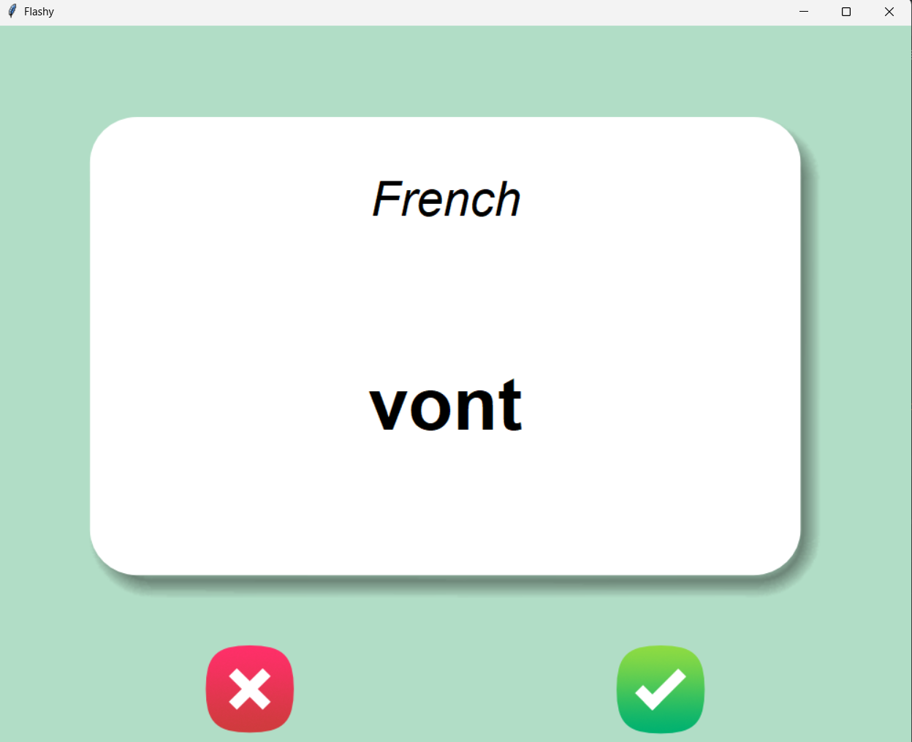
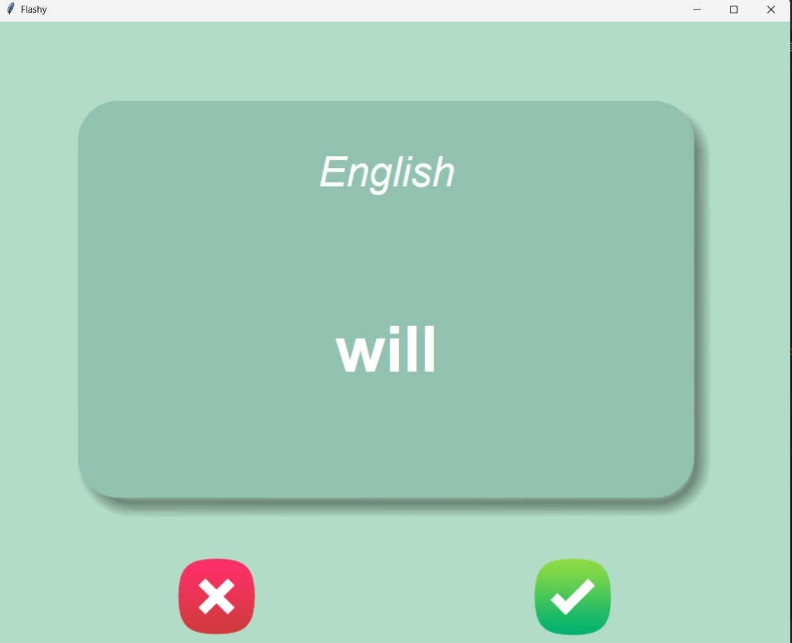

# Flash Card Learning App

A desktop flash card application built with Python and Tkinter to help learn French vocabulary.

## Features

- Randomly displays French words
- Automatically flips the card after 3 seconds
- Tracks words already learned
- Saves progress between sessions
- GUI built with Tkinter
- Data stored in CSV files using Pandas

## Technologies Used

- Python
- Tkinter
- Pandas

## Screenshots


images/back.png

## How to Run

1. Clone the repository

```bash
git clone https://github.com/yourusername/flash-card-app.git
